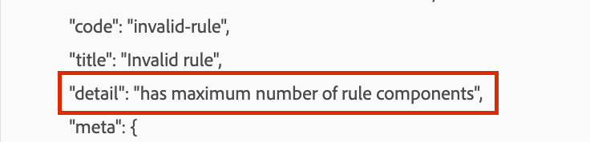

# Raccolta dati AEP | Errore: &quot;ha il numero massimo di componenti regola&quot; quando si aggiunge un evento personalizzato a una regola

Quando si aggiungono eventi a una regola in una proprietà di raccolta dati di un Experience Platform, se si verifica un errore che indica: &quot;ha il numero massimo di componenti regola&quot;, utilizza un codice personalizzato e un’istruzione select case.

## Descrizione {#description}

### <b>Ambiente</b>

- Adobe Experience Platform

- Raccolta dati

### <b>Problema/Sintomi</b>

I tag in Adobe Experience Platform seguono un sistema basato su regole.
*Eventi (If): la regola deve cercare l&#39;evento. Questo viene definito scegliendo un evento, eventuali condizioni applicabili ed eventuali eccezioni.*

Quando si tenta di aggiungere una condizione (evento) a una regola di proprietà che presenta già un numero elevato di tali condizioni, viene restituito un errore durante il salvataggio delle modifiche, come illustrato nella schermata seguente:

## Risoluzione {#resolution}

<b>Tag Adobe</b> consente fino a 100 eventi/condizioni in una regola di raccolta dati.

È generalmente riconosciuto che avere un numero eccessivo di condizioni per le regole non è comune ed è improbabile che l&#39;attuale limite venga aumentato. Se questa funzione presenta requisiti di autenticità, si consiglia di utilizzare un codice personalizzato e un’istruzione select case.
