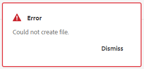

# Errore durante la creazione di un ditamap in AEM


Se ricevi un messaggio di errore - *Impossibile creare il file* durante la creazione di un <b>ditamap</b> in Adobe Experience Manager (AEM), è probabile che sia dovuto a un percorso non valido assegnato per gli stati del documento. Il percorso consigliato è `/content/dam` che è anche il percorso predefinito. Per risolvere il problema, segui i passaggi indicati in questo articolo.

## Descrizione {#description}


### <b>Ambiente</b>

Adobe Experience Manager

Guide di Adobe Experience Manager


### <b>Problema/Sintomi</b>

Durante la creazione di un’ <b>ditamap</b>, se sullo schermo viene visualizzato il seguente errore anche se la mappa dei tag è stata creata correttamente:




Nel registro degli errori vengono visualizzati i seguenti errori:


```
[ sling-threadpool-d9e57073-a6fb-498c-acdc-5427d775fa27-(apache-sling-job-thread-pool)-31-DXML Post Processing Queue(com/adobe/dxml/postprocess)]  com.adobe.fmdita.uuid.concrete.VersionReferenceCache Error: Unable to find btree prop for ref GUID-fe90ee76-5aa9-4ea2-9e73-61e57af9f0ec.ditamap
javax.jcr.PathNotFoundException: GUID-fe90ee76-5aa9-4ea2-9e73-61e57af9f0ec not found on /var/dxml/btree/version-references-v2/630dc546-719b-4bb8-bdf5-643c44c1bbc7/bc0cdd2b-562c-4619-a8b7-042b21b8cd66/25cf3f9e-7492-4316-8aa6-2a2282308887
at org.apache.jackrabbit.oak.jcr.session.NodeImpl$11.perform(NodeImpl.java:671) [ org.apache.jackrabbit.oak-jcr:1.58.0.T20231123092841-619e1bd]
```


e


```
[ sling-threadpool-d9e57073-a6fb-498c-acdc-5427d775fa27-(apache-sling-job-thread-pool)-31-DXML Post Processing Queue(com/adobe/dxml/postprocess)]  com.adobe.fmdita.uuid.concrete.CORDefaultPostProcess Error: Using default document state Draft due to
javax.jcr.RepositoryException: Unable to fetch states profile for path /content/dam/Matt/alison_test.ditamap Please check whether a Profile has been assigned
at com.adobe.fmdita.profiles.states.ProfileService.getProfileByPath(ProfileService.java:96) [ com.adobe.fmdita.utils:2023.12.0] 
at com.adobe.fmdita.uuid.concrete.CORDocstate.setdocstate(CORDocstate.java:37) [ com.adobe.fmdita.utils:2023.12.0] 
at com.adobe.fmdita.uuid.concrete.CORDocstate.execute(CORDocstate.java:23) [ com.adobe.fmdita.utils:2023.12.0] 
at com.adobe.fmdita.uuid.concrete.CORDefaultPostProcess.execute(CORDefaultPostProcess.java:1) [ com.adobe.fmdita.utils:2023.12.0]
```

` `


## Risoluzione {#resolution}


Per risolvere il messaggio di errore relativo alla creazione di un mapping, effettuare le seguenti operazioni:

1. Accedi a <b>Strumenti `>`  Guide `>`  Stati documento</b><b> `>`  Profilo predefinito</b> (oppure seleziona il profilo in uso) nell’interfaccia AEM.
2. Verificare che sia assegnato un percorso valido per gli stati del documento. Il percorso predefinito e consigliato è `/content/dam`.
3. Se il percorso è mancante o errato, aggiungi o correggi il percorso in `/content/dam`.
4. Salva le modifiche e prova a creare nuovamente una mappa digitale per confermare che l’errore è stato risolto.

