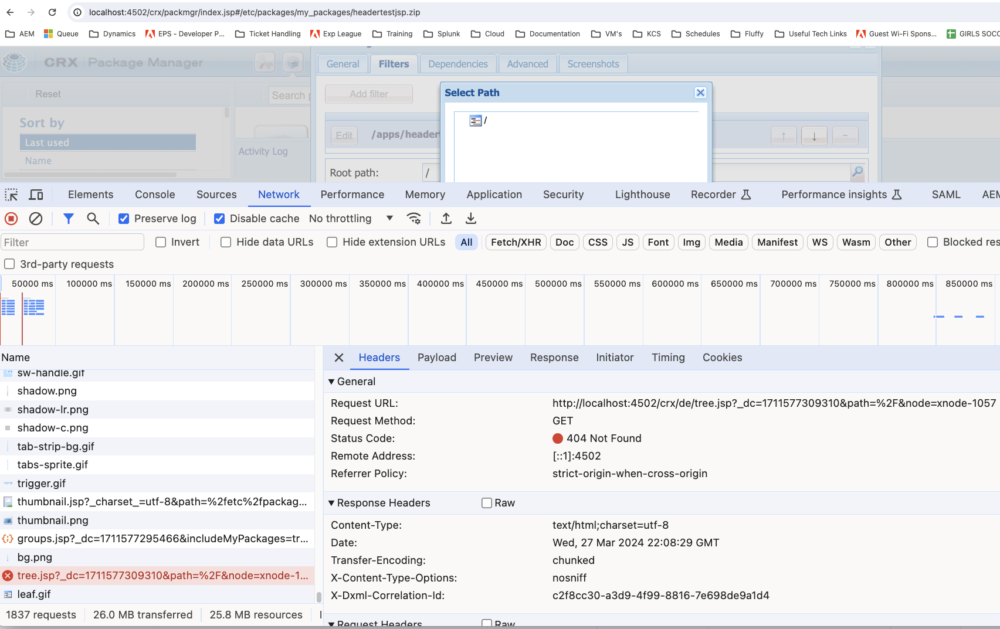

# Impossibile visualizzare le sottodirectory in Gestione pacchetti durante la creazione di nuovi filtri

In Adobe Experience Manager (AEM), gli amministratori possono rilevare un problema che impedisce la visualizzazione delle sottodirectory nell’interfaccia utente di Gestione pacchetti durante il tentativo di aggiungere nuovi filtri. Questo articolo fornisce una risoluzione per gli utenti che devono creare pacchetti che includono sottodirectory.

## Descrizione {#description}

Quando si utilizza Gestione pacchetti AEM per creare nuovi filtri per un pacchetto, l’interfaccia utente può visualizzare solo la directory principale, impedendo la selezione di sottodirectory.

Dopo aver esaminato questa finestra, puoi vedere negli strumenti per sviluppatori del browser che il file /crx/de/tree.jsp non è stato trovato.

Si verifica un errore simile anche quando si tenta di caricare l’applicazione CRX/DE (ad esempio http://`<` hostname/crx/de/index.jsp).

Questo comportamento può ostacolare la capacità di creare pacchetti completi per la distribuzione o l’implementazione.

## Risoluzione {#resolution}

Per risolvere il problema, eseguire la procedura seguente:

1. Vai ai bundle (http://localhost:4502/system/console/bundles)
2. Cerca &quot;crx&quot;
3. Assicurati che [Adobe Granite CRXDE Liti (*com.adobe.granite.crxde-lite)*](http://localhost:4502/system/console/bundles/241) il bundle è in esecuzione
4. Riprova il caso d’uso

Il CSE potrebbe anche essere in grado di abilitare temporaneamente questo per te.

Nota: la disabilitazione dei bundle CRX/DE sui sistemi di produzione è una policy di AMS. È fondamentale seguire le best practice di sicurezza per abilitare CRX DE Lite negli ambienti di produzione. L&#39;accesso deve essere limitato alle attività amministrative necessarie e l&#39;Explorer deve essere disattivato immediatamente dopo l&#39;uso.
